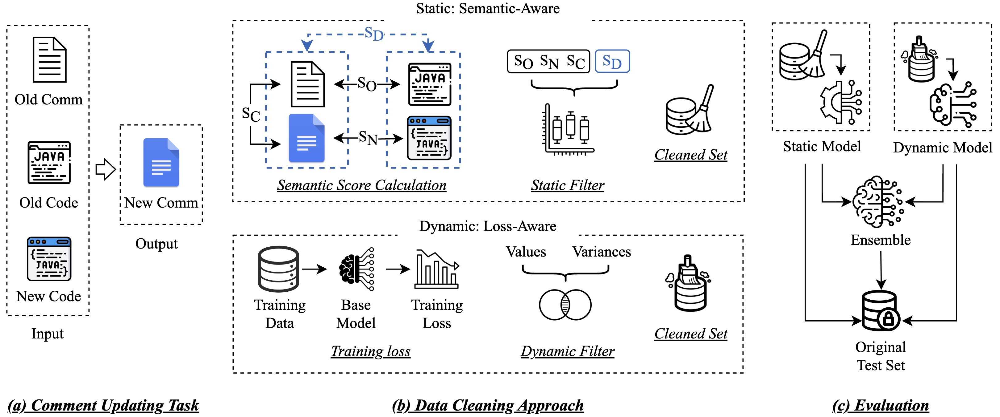

# CupCleaner: A Hybrid Data Cleaning Approach for Comment Updating

# Introduction

We propose semantic-aware static data cleaning strategies and loss-aware dynamic data cleaning strategies for data cleaning. 
An overview of our research procedure is described below:




# Dataset
You can download the original dataset and our cleaned dataset from the `dataset` folder.

# Training
You can train the model and reproduce our experimental results by running the `src/GoGoGo_CT5.py` file.

An example is shown below:
```
task='ACL'
maxSL, maxTL = task_length[task]
dataDir = '../dataset/ACL'
model_tag = f'CodeT5'+f'-{str(BSize)}-{str(LR)}-{str(GAcc)}'

gpuid=0
port = port+1
t = threading.Thread(target=run, args=(port, gpuid, model, model_tag, task, maxSL, maxTL, dataDir, BSize, GAcc, LR))
t.start()
```

You can run multiple versions of the training tasks by modifying the parameters in the file.


# Ensemble
You can check the improvements brought by combining different strategies in the `ensemble` folder.
The `acl.ipynb` and `aaai.ipynb` files are used to check the ensemble results for different datasets.

# Human Check
The data used for manual evaluation is in the `humancheck/check_with_label.csv` file. After removing the corresponding labels, the data was re-evaluated and scored manually. The final scores were determined through discussion and voting among multiple annotators. You can check the final manual scores and their relationship with our cleaning strategy in the `check.ipynb` file.